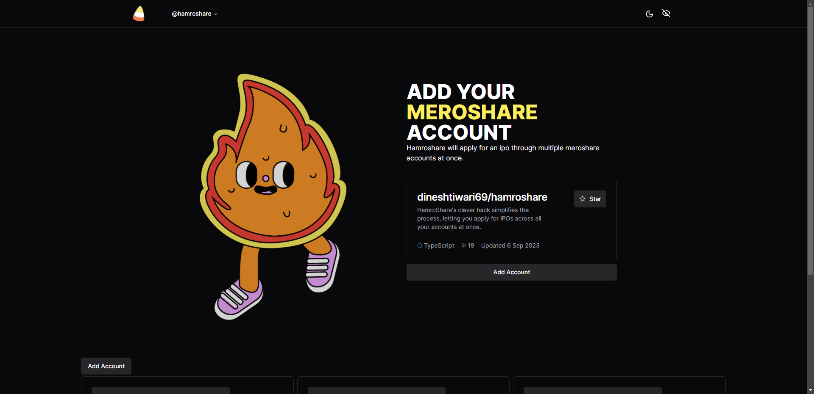

# ⚙️ HamroShare : Batch IPO Applier

HamroShare is a minimal web-application that lets you apply for IPOs from multiple meroshare accounts at once.


## 🚀 Live Demo

https://hamro-share.vercel.app/

## Preview


## FAQ

#### Is it Safe ?

Yes it is safe from the Account Stealing Aspect , but i don't know whats the CDSC's 
tos isfor the use of such Automation Software. Code is open-source , 
you can look at it yourself , build it yourself if you dont trust the existing build.

#### Are there any spooky backend API Linked With It ?

In the previous version , we were using meroshare's mobile api but now since they enabled cors restriction on their api , it wasn't possible without using serverside reverse proxy. We are using next.js api to bypass cors so technically there is a serverside involved .


## Features

- Runs on Web Browser
- User Friendly
- Automatic Batch Apply
- Quanity Selection/Account Selection

## Run Locally

Clone the project

```bash
  git clone https://github.com/dineshtiwari69/HamroShare
```

Go to the project directory

```bash
  cd HamroShare
```

Install dependencies

```bash
  yarn install
```
Start the server

```bash
  yarn dev
```
